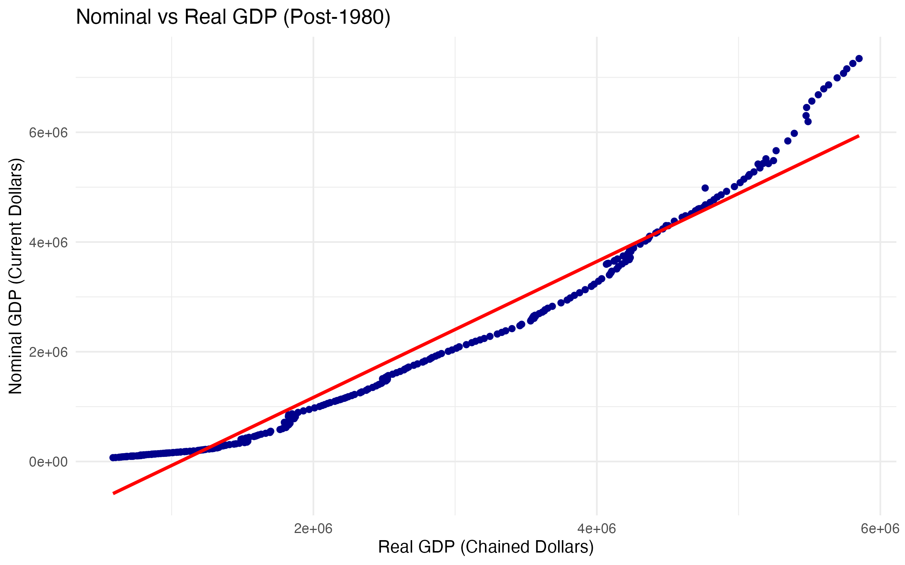
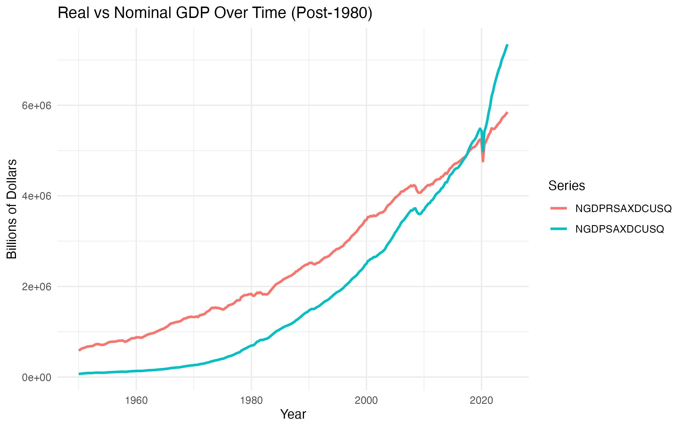

# MATH-144 Personal Data Project

This repository contains my personal data project for MATH-144.

# BIG QUESTION

The motivation behind this project was to understand how U.S. economic output has evolved over time and to visualize long-run trends in real GDP growth. I wanted to answer the question: How has U.S. GDP changed over the last several decades, and what patterns or deviations can we observe when we model this trend statistically?
I chose the U.S. GDP dataset because it is widely used in economics, easy to interpret, and directly connected to macroeconomic concepts such as growth, recessions, and long-term productivity trends.

# SOURCING AND CLEANING THE DATA

I obtained annual U.S. real GDP data from a website called  FRED 
The raw dataset included two fields: Year and Real GDP (billions of chained dollars).
Some GDP values contained commas, and the entire GDP column was imported as character instead of numeric.
I removed non-numeric characters using and then converted the column to numeric 
I checked for missing or incomplete years and removed rows with incomplete values.

## Visualization

Below is my visualization summarizing economic growth patterns:

## Summary

- Real GDP and Nominal GDP show a strong positive relationship.
- Inflation causes nominal GDP to grow faster than real GDP.
- A linear regression confirms this pattern with a very high R² value.

  
**Description.** Scatterplot of Nominal GDP vs Real GDP (Post-1980) with a fitted regression line.  
The plot shows a strong positive relationship between the two variables, where Nominal GDP rises
faster due to inflation, causing an upward curve in later years.

## Visualization 2

## Summary
The time series graph further shows that while both real and nominal GDP trend upward, nominal GDP grows at a noticeably faster rate, causing the gap between the two series to widen. This gap represents the increasing price level in the U.S. economy.

## ANALYSIS
The regression results show a strong and significant relationship between real GDP and nominal GDP. The estimated slope coefficient of 1.239 indicates that nominal GDP increases about 24% faster than real GDP, showing the effect of inflation on nominal values. The intercept is negative, but it has no meaningful economic interpretation since real GDP cannot be zero.

The model explains about 96% of the variation in nominal GDP (R² = 0.9599), indicating an excellent fit. The residuals are small relative to the data, further supporting the strong linear relationship between the two GDP measures. Overall, the model captures both long-run economic growth and the persistent upward trend in the U.S. price level.

